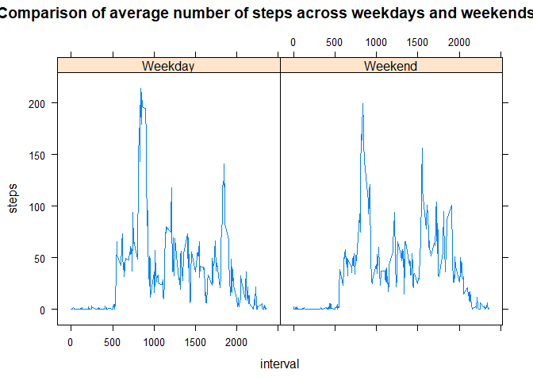

## Loading and preprocessing the data

```r
unzip(zipfile = "activity.zip")
activitywithna <- read.csv("activity.csv")
activity <- na.omit(activitywithna)
activity$date <- as.Date(activity$date)
```


## What is mean total number of steps taken per day?

```r
activitybydate <- group_by(activity,date)
totalsteps <- summarise(activitybydate,totalsteps=sum(steps))
hist(totalsteps$totalsteps,col=8,xlab="Total Steps per Day",main="Hitogram of Total Steps per Day")
```

<!-- -->

```r
meantotalsteps <- mean(totalsteps$totalsteps)
meantotalsteps
```

```
## [1] 10766.19
```

```r
mediantotalsteps <- median(totalsteps$totalsteps)
mediantotalsteps
```

```
## [1] 10765
```


## What is the average daily activity pattern?

```r
activitybyinterval <- group_by(activity,interval)
steppattern <- summarise(activitybyinterval,steps=mean(steps))
plot(steppattern$interval,steppattern$steps,type ="l",xlab = "5-minute Interval",ylab="Average Steps Taken",main="Average Daily Activity Pattern")
```

<!-- -->

```r
maxinterval <- as.numeric(steppattern[order(steppattern$steps,decreasing = TRUE),][1,1])
print("The 5-minute interval that, on average, contains the maximum number of steps:")
```

```
## [1] "The 5-minute interval that, on average, contains the maximum number of steps:"
```

```r
maxinterval
```

```
## [1] 835
```


## Imputing missing values

```r
numna <- sum(as.numeric(is.na(activitywithna$steps)))
print("Calculate and report the total number of missing values in the dataset ")
```

```
## [1] "Calculate and report the total number of missing values in the dataset "
```

```r
numna
```

```
## [1] 2304
```

```r
print("The strategy for imputing missing data is to use the mean for that 5-minute interval")
```

```
## [1] "The strategy for imputing missing data is to use the mean for that 5-minute interval"
```

```r
activityimputed <- activitywithna %>% group_by(interval) %>%mutate_all(impute,mean)
activitybydateimputed <- group_by(activityimputed,date)
totalstepsimputed <- summarise(activitybydateimputed,totalsteps=sum(steps))
hist(totalstepsimputed$totalsteps,col=8,xlab="Total Steps per Day",main="Hitogram of Total Steps per Day (Missing Value Imputed)")
```

<!-- -->

```r
meantotalstepsimputed <- mean(totalstepsimputed$totalsteps)
meantotalstepsimputed
```

```
## [1] 10766.19
```

```r
mediantotalstepsimputed <- median(totalstepsimputed$totalsteps)
mediantotalstepsimputed
```

```
## [1] 10766.19
```

```r
print("Mean is the same as the estimates from the first part of the assignment, while median is a bit different. Imputing the missing value may under-estimate the variation of the dataset.")
```

```
## [1] "Mean is the same as the estimates from the first part of the assignment, while median is a bit different. Imputing the missing value may under-estimate the variation of the dataset."
```


## Are there differences in activity patterns between weekdays and weekends?

```r
activityweekday <- mutate(activity,weekday=weekdays(date)) %>% mutate(Weekday=ifelse(weekday %in% c("Monday","Tuesday","Wedsday","Thursady","Friday"),"Weekday","Weekend")) %>% group_by(Weekday,interval)
steppatternweekday <- summarise(activityweekday,steps=mean(steps))
xyplot(steps~interval|Weekday,data=steppatternweekday,type="l",main="Comparison of average number of steps across weekdays and weekends")
```

<!-- -->

